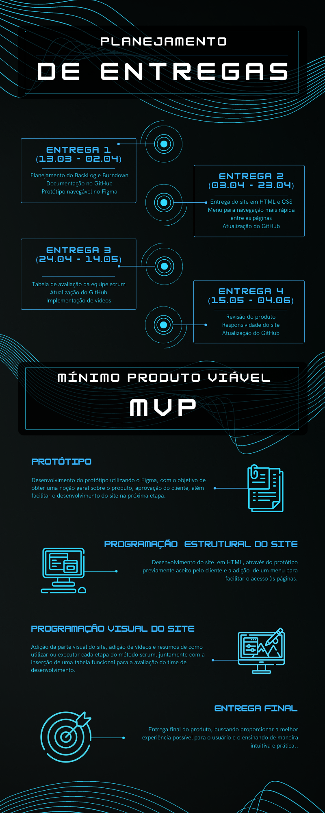

# DDT-1ºBim

## 📊 O que é a DDT?

DDT (Development Dream Team), é um time de desenvolvimento web do 1°Bimestre de Análise e Desenvolvimento da FATEC São José dos Campos - Prof. Jessen Vidal. A equipe possui como objetivo principal desenvolver  um  sistema  web que  indique  todos  os  processos  e  artefatos  da  metodologia  ágil (Scrum), com foco em deixar a aplicação fácil e intuitiva, proporcionando maior experiência para o usuário para que o mesmo possa aplicar as informações adiquiridas nos seus projetos futuros.

 

## 🎯 Desafio
Desenvolver  um  sistema  web que  indique  todos  os  processos  e  artefatos  da  metodologia  ágil (Scrum),  todos os processos deverão  ter conceitos  e  fundamentos  com  referências,  bem  como  a aplicação com exemplos práticos para aplena compreensão do usuário do sistema.

 

**<h2>👨‍💻 Equipe: </h2>**

  
|Nome|Função|GitHub|Linkedin|
| -------- |-------- |-------- |-------- |
|**Erick Hideki Oyakawa Awata**|Scrum Master|[@GitHub](https://github.com/erickhoawata)|[@Linkedin](http://linkedin.com/in/érick-awata)
|**Ryan Seiji Wakugawa**|Product Owner|[@GitHub](https://github.com/ryan-wakugawaa)|[@Linkedin]()
|**Maria Eduarda Peleteiro Leite**|Desenvolvedor|[@GitHub](https://github.com/Dudaleite08">)|[@Linkedin]()
|**Pedro Santos Kajiya**|Desenvolvedor|[@GitHub](https://github.com/kajiyap)|[@Linkedin](https://www.linkedin.com/in/pedro-santos-kajiya-65763b260/)
|**Cauã Nascimento Coelho Sbruzi Dezidera**|Desenvolvedor|[@GitHub](https://github.com/CauaDezidera)|[@Linkedin]() 
   
  

**<h2>⚙ Tecnologias Utilizadas</h2>**

  &nbsp;
  &nbsp;
  &nbsp;
  &nbsp;
  &nbsp;
  &nbsp;
  &nbsp;
  &nbsp;
  &nbsp;  

 

## 📋 Requisitos funcionais
  - Linguagem Python (Requisito Fatec)
  - Linguagem HTML e CSS (Requisito Fatec)
  - Uso do framework Bootstrap
  - Sistema Web intuitivo, simples e prático para facilitar a absorção do conteúdo
  - Criar um sistema de avaliação (Processo, Produto e Conhecimento em disciplina, Scrum Master, Product Owner, Time de Desenvolvimento)
  - Incluir os pilares, artefatos, equipe e eventos

 

## 🔗 Requisitos não funcionais
 - Documentação via Github
 - Linguagem de programação Python, framework Flask.
 - Linguagem de marcação HTML e CSS.

 

**<h2>🗂 Planejamento de Entregas e MVP</h2>**

 

**<h2>🖥 Site desenvolvido em HTML e CSS </h2>**
O protótipo no Figma, foi desenvolvido para receber a aprovação prévia do cliente e para a vizualização do projeto sem que todo o código tenha que ser baixado. 
<a href="https://www.figma.com/file/tDrqLQKNsiGbglnTp2CcwX/Prot%C3%B3tipo-API?node-id=0%3A1&t=iDi9wkiwjeJAybF1-1">Link para o protótipo</a> 

https://github.com/erickhoawata/DDT-1-Bim/assets/126245787/da5ee34f-5867-4ed7-9f38-a1de1a88547b

