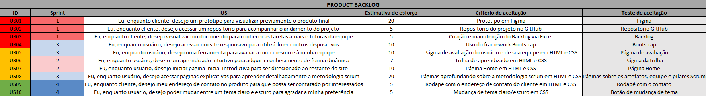
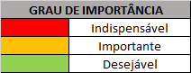

# DDT-1ºBim

**<h2>📊 O que é a DDT?</h2>**
DDT (Development Dream Team), é um time de desenvolvimento web do 1°Bimestre de Análise e Desenvolvimento da FATEC São José dos Campos - Prof. Jessen Vidal. A equipe possui como objetivo principal desenvolver  um  sistema  web que  indique  todos  os  processos  e  artefatos  da  metodologia  ágil (Scrum), com foco em deixar a aplicação fácil e intuitiva, proporcionando maior experiência para o usuário para que o mesmo possa aplicar as informações adiquiridas nos seus projetos futuros.

**<h2>👨‍💻 Equipe: </h2>**
<li>
<a href="https://github.com/erickhoawata">Erick Hideki Oyakawa Awata</a> (SM)  
</li>
<li>
<a href="https://github.com/ryan-wakugawa">Ryan Seiji Wakugawa</a> (PO)  
</li>
<li>
<a href="https://github.com/Dudaleite08">Maria Eduarda Peleteiro Leite </a> (ST)  
</li>
<li>
<a href="https://github.com/cipriano1419">Matheus Cipriano Machado </a> (ST)   
</li>
<li>
<a href="https://github.com/kajiyap">Pedro Santos Kajiya </a> (ST)   
</li>
<li>
<a href="https://github.com/CauaDezidera">Cauã Nascimento Coelho Sbruzi Dezidera </a> (ST)   
</li>

**<h2>🖥 Protótipo do Produto (Figma) </h2>**
O protótipo no Figma, foi desenvolvido para receber a aprovação prévia do cliente e para a vizulização do projeto sem que todo o código tenha que ser baixado. 
<a href="https://www.figma.com/file/tDrqLQKNsiGbglnTp2CcwX/Prot%C3%B3tipo-API?node-id=0%3A1&t=iDi9wkiwjeJAybF1-1">Link para o protótipo</a> 

**<h2>📑 Entregas</h2>**

**<h3>Entrega 1 (13.03 - 02.04)</h3>**
- [x] Planejamento do BackLog e Burndown  
- [x] Documentação no GitHub
- [x] Protótipo navegável no Figma

**<h3>📑 Entrega 2 (03.04 - 23.04)</h3>**
- [x] Tela Home  
- [x] Tela trilha de aprendizagem
- [x] Tela ferramentas
- [x] Tela equipe
- [x] Tela eventos
- [x] Tela artefatos
- [x] Tela três pilares 
- [x] Tela de avaliação

**<h2>⚙ Tecnologias Utilizadas</h2>**
<li>
<a href="https://www.figma.com/">Figma</a> 
</li>
<li>
<a href="https://trello.com/pt-BR">Trello</a> 
</li>
