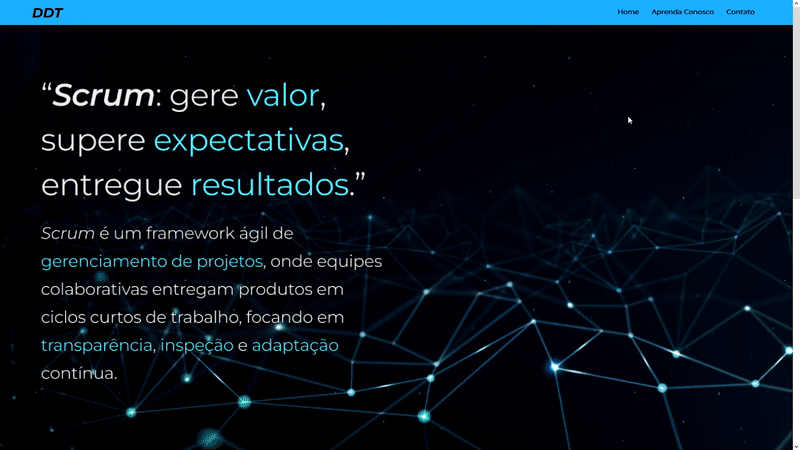

# DDT 1ºBim

- [O que é a DDT?](#o-que-é-a-ddt)
- [Desafio](#desafio)
- [Equipe](#equipe)
- [teste](#requisitos-funcionais)

## O que é a DDT

DDT (Development Dream Team), é um time de desenvolvimento web do 1°Bimestre de Análise e Desenvolvimento da FATEC São José dos Campos - Prof. Jessen Vidal. A equipe possui como objetivo principal desenvolver  um  sistema  web que  indique  todos  os  processos  e  artefatos  da  metodologia  ágil (Scrum), com foco em deixar a aplicação fácil e intuitiva, proporcionando maior experiência para o usuário para que o mesmo possa aplicar as informações adiquiridas nos seus projetos futuros.

<br>

## Desafio

Desenvolver  um  sistema  web que  indique  todos  os  processos  e  artefatos  da  metodologia  ágil (Scrum),  todos os processos deverão  ter conceitos  e  fundamentos  com  referências,  bem  como  a aplicação com exemplos práticos para aplena compreensão do usuário do sistema.

<br>

## Equipe
<div align="center">
  
|Nome|Função|GitHub|Linkedin|
| -------- |-------- |-------- |-------- |
|**Erick Hideki Oyakawa Awata**|Scrum Master|[@GitHub](https://github.com/erickhoawata)|[@Linkedin](http://linkedin.com/in/érick-awata)
|**Ryan Seiji Wakugawa**|Product Owner|[@GitHub](https://github.com/ryan-wakugawaa)|[@Linkedin]()
|**Maria Eduarda Peleteiro Leite**|Desenvolvedor|[@GitHub](https://github.com/Dudaleite08">)|[@Linkedin]()
|**Pedro Santos Kajiya**|Desenvolvedor|[@GitHub](https://github.com/kajiyap)|[@Linkedin](https://www.linkedin.com/in/pedro-santos-kajiya-65763b260/)
|**Cauã Nascimento Coelho Sbruzi Dezidera**|Desenvolvedor|[@GitHub](https://github.com/CauaDezidera)|[@Linkedin]() 
<br>  
  
</div>

## Requisitos funcionais
  - Linguagem Python (Requisito Fatec)
  - Linguagem HTML e CSS (Requisito Fatec)
  - Uso do framework Bootstrap
  - Sistema Web intuitivo, simples e prático para facilitar a absorção do conteúdo
  - Criar um sistema de avaliação (Processo, Produto e Conhecimento em disciplina, Scrum Master, Product Owner, Time de Desenvolvimento)
  - Ensinar o usuário sobre os pilares, artefatos, equipe, eventos e suas ramificações.

<br>

## 🔗 Requisitos não funcionais
 - Documentação via Github
 - Linguagem de programação Python, framework Flask.
 - Linguagem de marcação HTML e CSS.

<br>

**<h2>🏆 MVP</h2>**
<div align="center">


</div>
<br>

**<h2>🗂 Planejamento de Entregas</h2>**
<div align="center">


</div>
<br>

**<h2>🛠 Ferramentas utilizadas</h2>**
<div align="center">
  

  
</div>
<br>

**<h2>🔗 Link para o protótipo desenvolvido no Figma </h2>**
O protótipo no Figma, foi desenvolvido para receber a aprovação prévia do cliente e para a vizualização do projeto sem que todo o código tenha que ser baixado.<br>

<div align="center">
<a href="https://www.figma.com/file/tDrqLQKNsiGbglnTp2CcwX/Prot%C3%B3tipo-API?node-id=0%3A1&t=iDi9wkiwjeJAybF1-1">Clique aqui para acessar o nosso protótipo</a><br>
</div>

**<h2>🖥 Site desenvolvido em HTML e CSS </h2>**
Site desenvolvido pela equipe DDT, onde procuramos entregar o máximo de valor em cada sprint.

<div align="center">



</div>

<div align="center">

https://github.com/erickhoawata/DDT-1-Bim/assets/126245787/da5ee34f-5867-4ed7-9f38-a1de1a88547b

</div >

<br>


<br>

## ⁉ Como instalar o nosso site?
I - Clonar o repositório
```
git clone https://github.com/erickhoawata/DDT-1-Bim.git
```
II - Clonar o repositório
```
git clone https://github.com/erickhoawata/DDT-1-Bim.git
```

